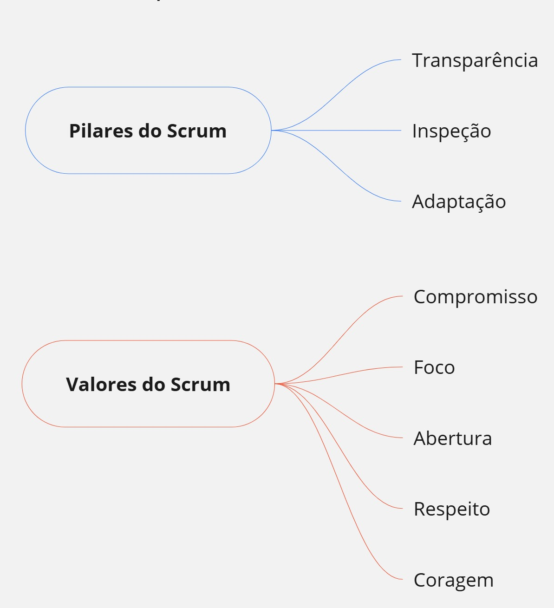
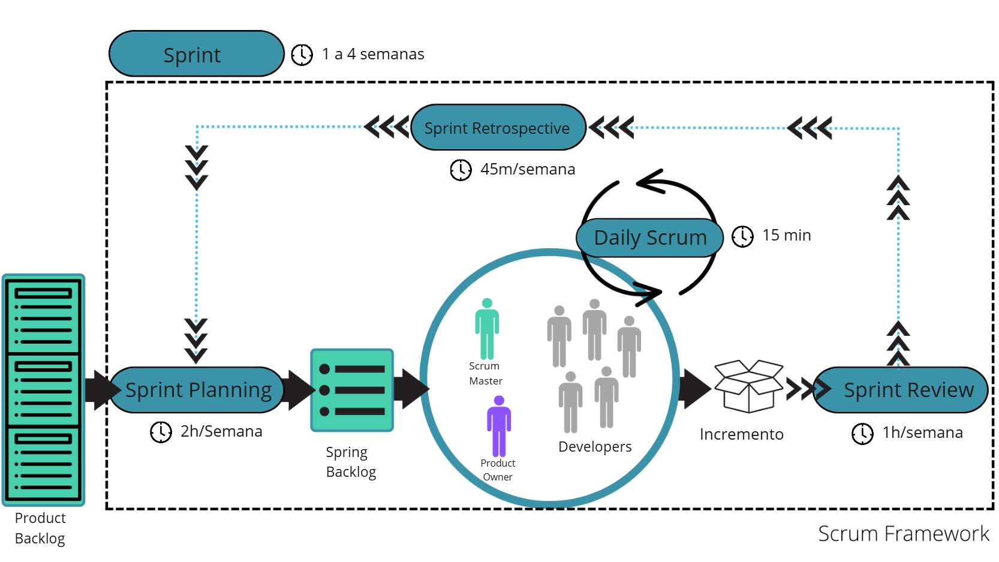

# Compreendendo a Estrutura Scrum
O scrum é um framework de uso crescente em ambientes complexos.

## Definição    
Scrum é um framework leve que ajuda pessoas, times e organizações a gerar valor por meio
de soluções adaptativas para problemas complexos.

### O Scrum possui 3 pilares e 5 valores bem definidos:

Seus componentes essenciais podem ser definidos com uma estrutura 3 → 5 → 3

- **3 Papéis**
  - **Product Owner:** É responsável por maximizar o valor do produto resultante do trabalho do Scrum Team. A forma como isso é feito pode variar amplamente entre organizações, Scrum Teams e indivíduos.
  - **Scrum Master:** Responsável por estabelecer o Scrum conforme definido no Guia do Scrum. Eles fazem isso ajudando todos a entender a teoria e a prática do Scrum, tanto no Scrum Team quanto na organização.
  - **Developers:** São as pessoas do Scrum Team que estão comprometidas em criar qualquer aspecto de um Incremento utilizável a cada Sprint.

- **5 Eventos**
  - **Sprint**(1 a 4 semanas): Onde idéias são transformadas em valor
  - **Sprint Planning**(2h/semana): Por que esta Sprint é valiosa? O que pode ser feito nesta Sprint? E Como o trabalho escolhido será realizado?
  - **Daily Scrum**(15min):O propósito da Daily Scrum é inspecionar o progresso em direção a Meta da Sprint e adaptar o Sprint Backlog conforme necessário, ajustando o próximo trabalho planejado.
  - **Sprint Review**(1h/semana): O propósito da Sprint Review é inspecionar o resultado da Sprint e determinar as adaptações futuras. O Scrum Team apresenta os resultados de seu trabalho para os principais stakeholders e o progresso em direção a Meta do Produto é discutido.
  - **Sprint Retroespective**(45m/semana): O propósito da Sprint Retrospective é planejar maneiras de aumentar a qualidade e a eficácia.

- **3 Artefatos**
  - **Product Backlog:** É uma lista ordenada e emergente, de responsabilidade do P.O, do que é necessário para melhorar o produto. É a única fonte de trabalho realizado pelo Scrum Team.
  - **Sprint Backlog:** O Sprint Backlog é composto pela Meta da Sprint (por que), o conjunto de itens do Product Backlog selecionados para a Sprint (o que), bem como um plano de ação para entregar o Incremento (como). O Sprint Backlog é um plano feito por e para os Developers.
  - **Incremento:** É um trampolim concreto em direção a Meta do produto. No momento em que um item do Product Backlog atende a Definição de Pronto, um incremento nasce.

>*O TimeBox de cada `Evento` acima depende da duração da sprint que deve ser de 1 a 4 semanas, portanto, para um sprint de 2 semanas por exemplo, terá um TimeBox de sprint planning de 4 horas (2h/semana)*

Para melhor fixação do framework Scrum, temos abaixo uma representação visual com fluxo dos papeis, eventos e artefatos:

As imagens aqui apresentadas fazem parte do desafio de projeto: Completando o FrameWork Scrum da formação de Scrum Master da DIO. O desafio pode ser conferido no link abauxo:
https://miro.com/app/board/uXjVGdDWiis=/

Autor: Nayara Almeida.

